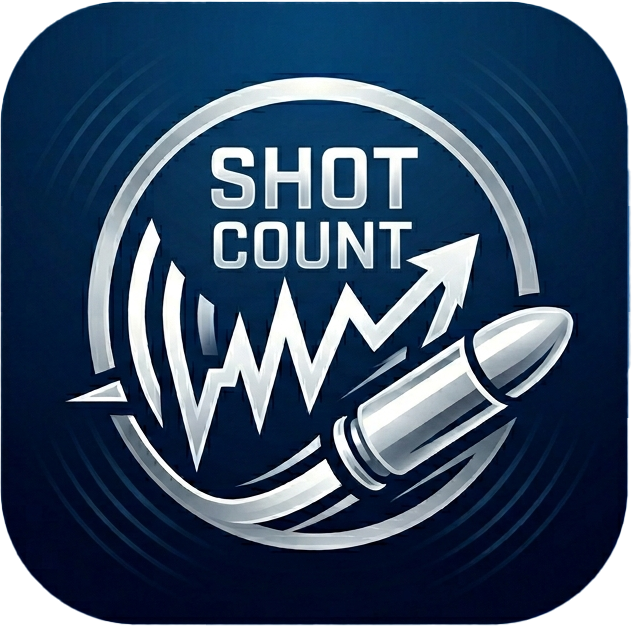
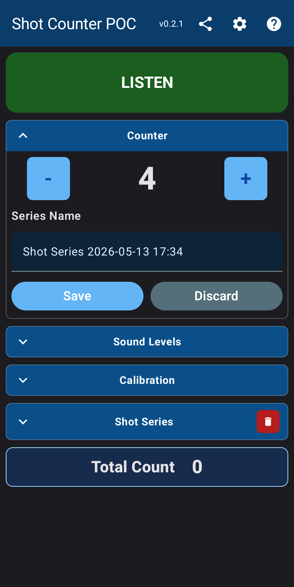
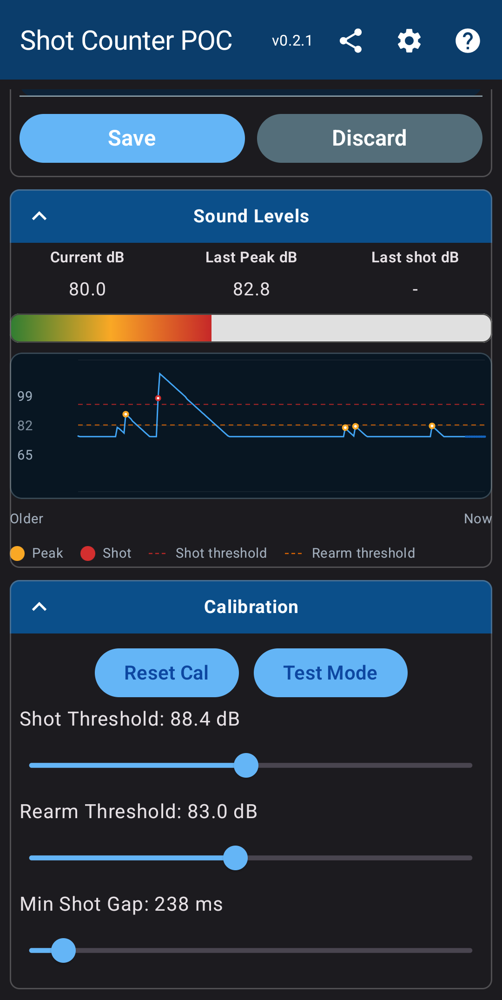
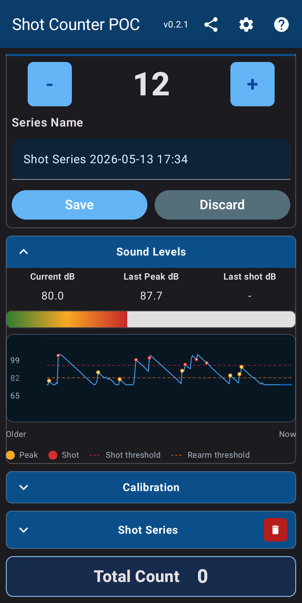
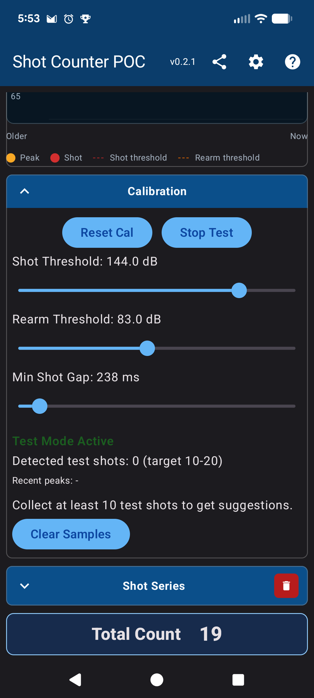
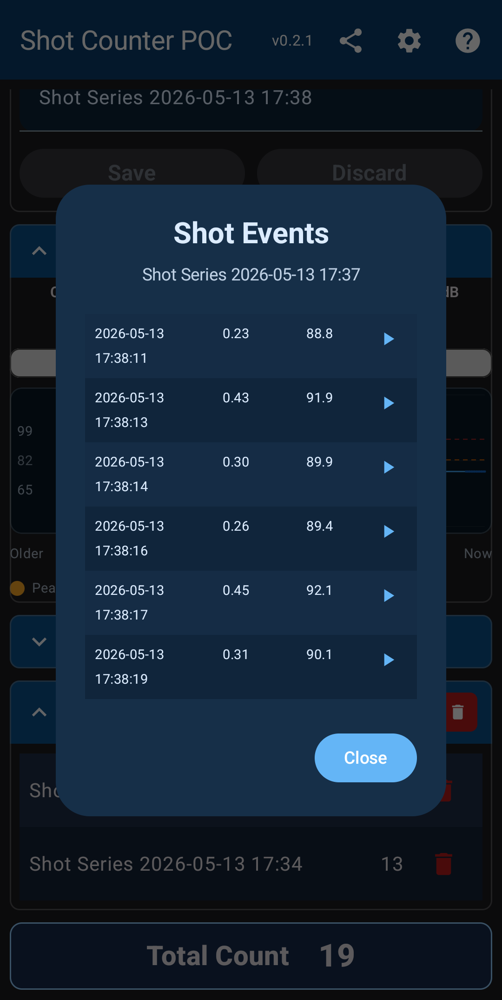
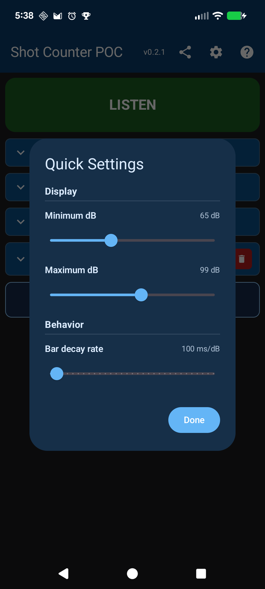
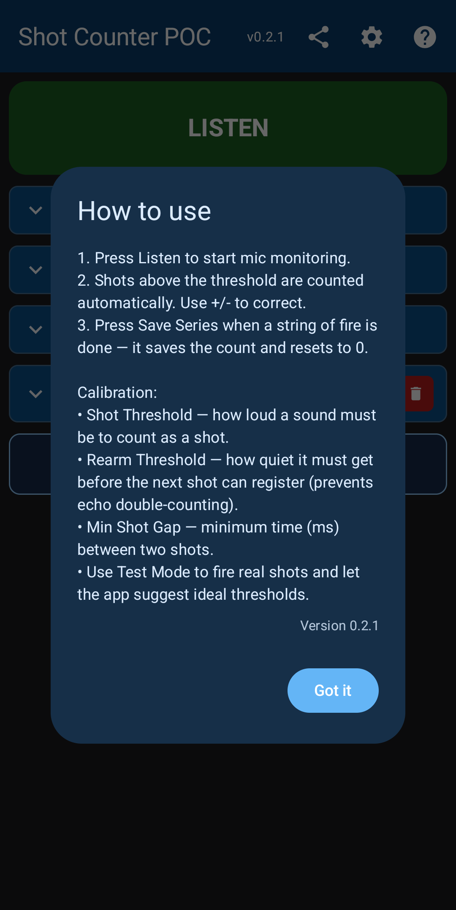

	

# Shot Counter POC

Shot Counter POC is an Android app for counting gunshots in real time using microphone input, with on-range calibration controls (thresholds and shot gap), auto-calibration tuning, and persistent shot-series tracking.

## Screenshots

<table>
  <tr>
    <td align="center" width="220">
       
      <b>Main Screen</b> 
      The home screen with all collapsible sections (Counter, Sound Levels, Calibration, Shot Series) and the LISTEN toggle button.
    </td>
    <td align="center" width="220">
       
      <b>Counter</b> 
      The Counter section open showing the shot count, +/- adjustment buttons, series name field, and Save/Discard buttons.
    </td>
    <td align="center" width="220">
       
      <b>Sound Levels</b> 
      The Sound Levels panel with live dB bar, dB trend graph with peak and shot markers, and calibration sliders below.
    </td>
  </tr>
  <tr>
    <td align="center" width="220">
       
      <b>Active Detection</b> 
      Live detection in action with 12 shots counted; the trend graph shows gold peak markers and red shot markers across recent history.
    </td>
    <td align="center" width="220">
       
      <b>Calibration</b> 
      Calibration section with Shot Threshold, Rearm Threshold, and Min Shot Gap sliders for tuning detection to the range environment.
    </td>
    <td align="center" width="220">
       
      <b>Auto Calibrate</b> 
      Auto Calibrate active — fire representative shots and the app analyzes captured calibration events to suggest optimized threshold values.
    </td>
  </tr>
  <tr>
    <td align="center" width="220">
       
      <b>Shot Series</b> 
      The Shot Series section listing saved series by timestamp with shot counts, per-row delete, and a Total Count footer.
    </td>
    <td align="center" width="220">
       
      <b>Shot Events</b> 
      The Shot Events dialog for a saved series showing each detected shot's timestamp, confidence score, peak dB, and an audio clip play button.
    </td>
    <td align="center" width="220">
       
      <b>Quick Settings</b> 
      The Quick Settings dialog (gear icon) for adjusting the dB display range (min/max) and the bar decay rate.
    </td>
  </tr>
  <tr>
    <td align="center" width="220">
       
      <b>How to Use</b> 
      The help dialog (? icon) with a quick-start guide and a summary of each calibration parameter's purpose.
    </td>
  </tr>
</table>

## Project

Workspace root contains general project assets and docs.

Android project root: `app/`

## Build
1. Open the `app/` folder as an Android project in Android Studio, or run commands in `app/`.
2. Build with `gradlew.bat assembleDebug` from `app/` on Windows.

## Android Studio Run Checklist
1. Open Android Studio and open the `app/` folder.
2. Wait for Gradle sync to complete.
3. Open `Run > Edit Configurations...`.
4. Create an `Android App` configuration if one does not already exist.
5. Set `Name` to `ShotCounterPOC`.
6. Set `Module` to `app`.
7. Set `Launch Options` to default activity.
8. Select a target device (physical preferred for microphone testing).
9. Click Run. Reuse this configuration for one-click launches.

## Implemented POC Features
- Title bar: Shot Counter POC.
- Large counter with square + and - buttons.
- Listen/STOP toggle with microphone permission request.
- Live dB display bar scaled from 50 dB to 180 dB with green-to-red gradient.
- Fast-rise / slow-fall dB smoothing so quick peaks remain visible.
- Temporary last-shot dB display when a shot-like sound is detected.
- In-app calibration controls for shot threshold, rearm threshold, and minimum shot gap.
- Auto Calibrate mode that records calibration shot events and suggests tuned values after enough samples.
- Save Series form with default name: Shot Series YYYY-MM-DD HH:MM (24-hour).
- Series table with newest-first ordering, row delete, and delete-all confirmation.
- Total Count footer summing all saved series counts.
- Back button behavior: if a series is in progress, save with default name and exit.

## Storage
- Uses SharedPreferences for simple POC persistence of shot series (name + count + created timestamp).
- No relational database is used in this POC stage.

## Detection Notes
- Current detection is a practical loud-sound heuristic using AudioRecord RMS-to-dB approximation.
- The dB value is relative (not calibrated SPL).
- Adjacent lane shots, suppressors, and environment require on-range threshold tuning.
- Calibration values are persisted between app launches.

## Auto Calibrate
1. Tap `Auto Calibrate` in the calibration section.
2. Fire at least 10 representative calibration shots.
3. Review captured shot events and suggested values.
4. Check suggestion confidence (High/Medium/Low) before applying.
5. Tap `Apply Suggested` to update thresholds and shot gap.
6. Tap `Clear Samples` to start a fresh test set.

## Troubleshooting
1. Gradle sync fails with JDK errors:
	- In Android Studio, set Gradle JDK to the bundled JBR (`File > Settings > Build, Execution, Deployment > Build Tools > Gradle`).
	- Re-sync the project.

2. Android SDK or Build-Tools missing:
	- Open `File > Settings > Android SDK` and install required Platform + Build-Tools.
	- Re-run sync/build.

3. Build fails from terminal:
	- Run from the Android project folder (`app/`).
	- On Windows use `gradlew.bat assembleDebug`.
	- If your shell cannot find Gradle wrapper, run it with an explicit path.

4. App does not detect shots:
	- Ensure microphone permission is granted in Android settings.
	- Confirm `Listen` is active.
	- Use Auto Calibrate and tune thresholds for your range environment.

5. Counts seem too high (false positives):
	- Increase Shot Threshold.
	- Increase Min Shot Gap.
	- Reduce device proximity to neighboring lanes if possible.

6. Counts seem too low (missed shots, suppressor use):
	- Lower Shot Threshold.
	- Lower Rearm Threshold slightly.
	- Re-run Auto Calibrate with representative shots.

## Changelog

### v0.2.2

#### Auto Calibration Workflow
- **Auto-listen integration:** Starting Auto Calibrate now starts listening automatically; stopping Auto Calibrate stops listening as part of the same flow.
- **Dedicated calibration series:** Calibration shots are captured as shot events (including clip recording) and are saved to a separate `Auto Calibration <date>` series.
- **Background persistence:** Calibration data is saved automatically when calibration ends, including stop-listening and app-exit paths, without prompting.

#### UI Updates
- **Renamed flow:** `Test Mode` is now `Auto Calibrate`, and active status text is now `Auto Calibration in Progress`.
- **Live calibration table:** Auto calibration now shows a shot events table (timestamp/confidence/peak dB/clip controls) instead of plain peak text output.
- **Progress emphasis:** Added a bold `Test Shots: X / 10` indicator with a red-to-yellow-to-green progress color.
- **Button shape polish:** Converted key action buttons to square rounded buttons for visual consistency.

### v0.2.1

#### Bug Fixes
- **Shot marker rendering:** Fixed red circle markers being hidden by overlapping gold peak markers. Markers now render in correct z-order (peaks first, then shots on top).

#### Technical Improvements
- **Room database:** Upgraded from 2.6.1 to 2.7.1 for full KSP2 compatibility, fixing build errors with AGP 9.
- **Build system:** Cleaned up deprecated AGP options while maintaining KSP compatibility. Kotlin JVM target now properly configured with modern compilerOptions DSL.

### v0.2.0

#### Core Improvements
- **Dynamic peak sensitivity:** Peak confirmation threshold now scales with display range (4% of y-axis span) instead of fixed 1.2 dB, eliminating false peak clusters during sound decay.
- **Peak re-arm mechanism:** After confirming a peak, the detector enters "unarmed" state until the signal bottoms out and rises again by the drop-confirmation threshold, preventing repeated peaks on gentle descents.
- **Decay rate unit swap:** Bar decay changed from dB/second to ms/dB (higher = slower decay), with slider increments of 100 ms, making sensitivity more intuitive.
- **Calibration range expansion:** Shot Threshold (1–180 dB) and Rearm Threshold (0–179 dB) now allow lower values while maintaining 1 dB gap.

#### UI/UX Polish
- **Exit dialog layout:** Save and Discard buttons are now equal width, centered horizontally with 16 dp gap between them.
- **Slider granularity:** Decay rate slider now uses discrete 100 ms steps (0–3000 ms/dB range).
- **Label clarity:** Decay rate displays "Hold" at 0, or "{n} ms/dB" otherwise.

#### Technical Details
- Added `peakRearmed`, `peakMinAfterConfirm` tracking variables for re-arm state.
- Renamed `barDecayDbPerSecond` → `barDecayMsPerDb` throughout (ViewModel, UI, prefs).
- Updated decay formula: `decayAmount = elapsedMs / barDecayMsPerDb` (or 0 if disabled).
- Removed display-range-dependent `maxDecay` clamping; decay rate now independent of display bounds.
- LabeledSliderField now supports optional `steps` parameter for discrete slider increments.
