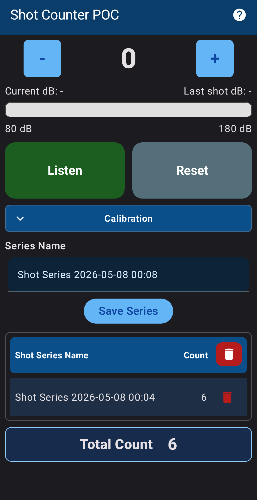
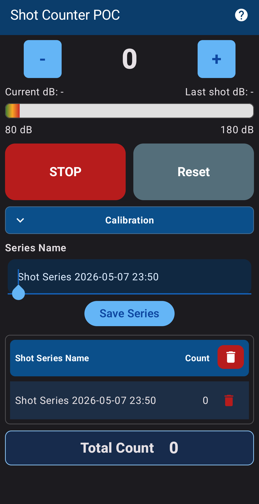
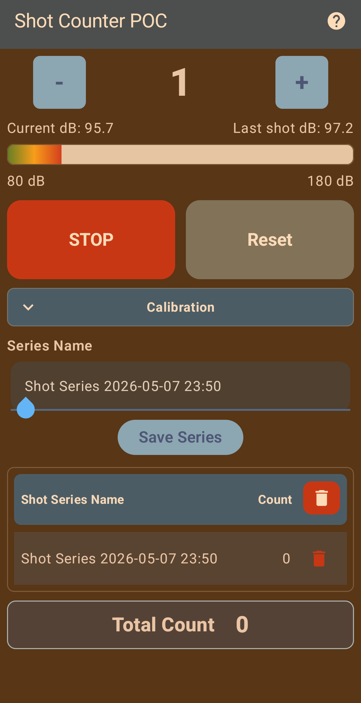
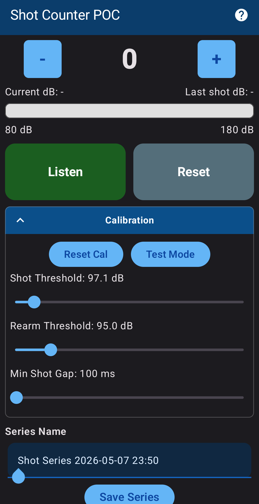
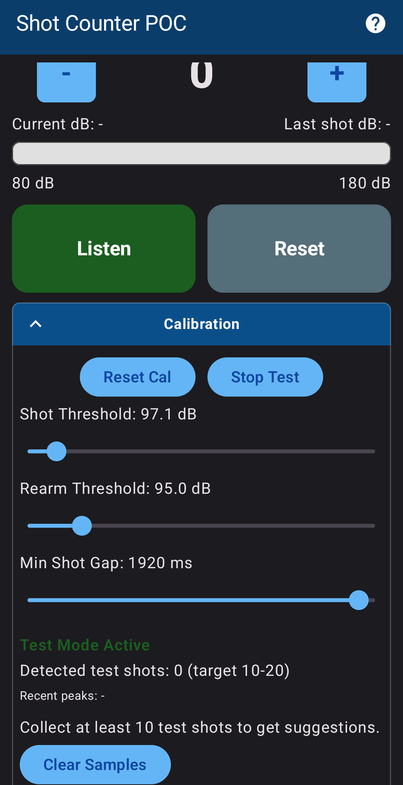
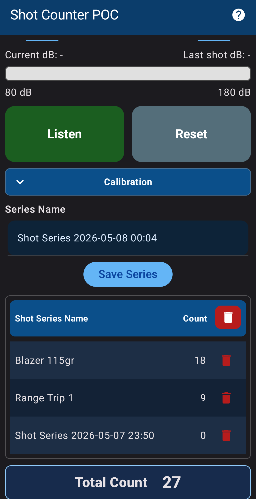
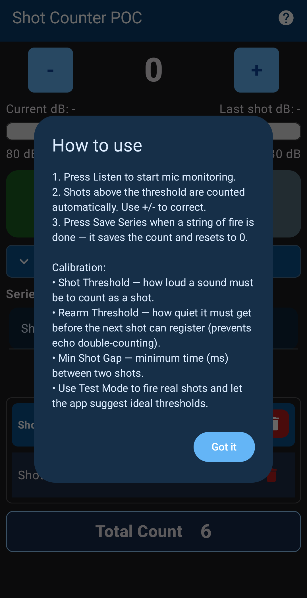

# Shot Counter POC

Shot Counter POC is an Android app for counting gunshots in real time using microphone input, with on-range calibration controls (thresholds and shot gap), test mode tuning, and persistent shot-series tracking.

## Screenshots

## Project

Workspace root contains general project assets and docs.

Android project root: `app/`

## Build
1. Open the `app/` folder as an Android project in Android Studio, or run commands in `app/`.
2. Build with `gradlew.bat assembleDebug` from `app/` on Windows.

## Android Studio Run Checklist
1. Open Android Studio and open the `app/` folder.
2. Wait for Gradle sync to complete.
3. Open `Run > Edit Configurations...`.
4. Create an `Android App` configuration if one does not already exist.
5. Set `Name` to `ShotCounterPOC`.
6. Set `Module` to `app`.
7. Set `Launch Options` to default activity.
8. Select a target device (physical preferred for microphone testing).
9. Click Run. Reuse this configuration for one-click launches.

## Implemented POC Features
- Title bar: Shot Counter POC.
- Large counter with square + and - buttons.
- Listen/STOP toggle with microphone permission request.
- Live dB display bar scaled from 50 dB to 180 dB with green-to-red gradient.
- Fast-rise / slow-fall dB smoothing so quick peaks remain visible.
- Temporary last-shot dB display when a shot-like sound is detected.
- In-app calibration controls for shot threshold, rearm threshold, and minimum shot gap.
- Calibration Test Mode that records peak history and suggests tuned values after enough samples.
- Save Series form with default name: Shot Series YYYY-MM-DD HH:MM (24-hour).
- Series table with newest-first ordering, row delete, and delete-all confirmation.
- Total Count footer summing all saved series counts.
- Back button behavior: if a series is in progress, save with default name and exit.

## Storage
- Uses SharedPreferences for simple POC persistence of shot series (name + count + created timestamp).
- No relational database is used in this POC stage.

## Detection Notes
- Current detection is a practical loud-sound heuristic using AudioRecord RMS-to-dB approximation.
- The dB value is relative (not calibrated SPL).
- Adjacent lane shots, suppressors, and environment require on-range threshold tuning.
- Calibration values are persisted between app launches.

## Calibration Test Mode
1. Tap `Test Mode` in the calibration section.
2. Fire 10-20 representative test shots.
3. Review recent peak history and suggested values.
4. Check suggestion confidence (High/Medium/Low) before applying.
5. Tap `Apply Suggested` to update thresholds and shot gap.
6. Tap `Clear Samples` to start a fresh test set.

## Troubleshooting
1. Gradle sync fails with JDK errors:
	- In Android Studio, set Gradle JDK to the bundled JBR (`File > Settings > Build, Execution, Deployment > Build Tools > Gradle`).
	- Re-sync the project.

2. Android SDK or Build-Tools missing:
	- Open `File > Settings > Android SDK` and install required Platform + Build-Tools.
	- Re-run sync/build.

3. Build fails from terminal:
	- Run from the Android project folder (`app/`).
	- On Windows use `gradlew.bat assembleDebug`.
	- If your shell cannot find Gradle wrapper, run it with an explicit path.

4. App does not detect shots:
	- Ensure microphone permission is granted in Android settings.
	- Confirm `Listen` is active.
	- Use Calibration Test Mode and tune thresholds for your range environment.

5. Counts seem too high (false positives):
	- Increase Shot Threshold.
	- Increase Min Shot Gap.
	- Reduce device proximity to neighboring lanes if possible.

6. Counts seem too low (missed shots, suppressor use):
	- Lower Shot Threshold.
	- Lower Rearm Threshold slightly.
	- Re-run Calibration Test Mode with representative shots.
